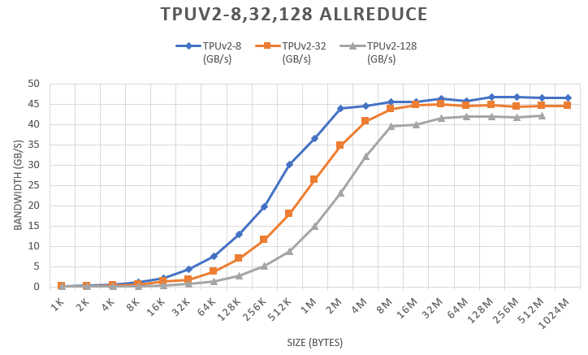

# TPU_All_reduce

该项目用于测量TPU Allreduce带宽

# 文件说明

- mnist_tpu.py: 用于测试的主文件
- parse_gzfile.py: 用于解析生成的log文件，得到通信带宽
- p*.sh：用于跟踪测量对应TPU的计算流程，例如p8.sh要配合run8.sh使用，具体方法见下面的说明。
- run*.sh: 控制运行mnist_tpu.py的脚本文件，run8.sh表示用TPUv2-8运行，其他同理。在运行时只需要指定一个参数，即scale。该参数用于控制模型（即通信数据）的大小的变化，即当`scale>0`时`Model size=scale`， 反之`Model size=1024/scale`,`scale`的取值为1,±2,±4,±8,±16,±32,±64,±128,±256,±512,±1024。
- parsedLog.log: 整理得到的各个TPU的带宽计算结果。

# 实验方法

## 实验环境

- python2.7
- tensorflow 1.12
- TPUv-8, 32, 128

## 运行代码和测速

建议使用tmux创建两个独立的窗口，

- 在一个窗口下运行：`./run8.sh 1`
- 在另一个窗口下运行：`./p8.sh 1`

将参数可分别从调整为 1,±2,±4,±8,±16,±32,±64,±128,±256,±512,±1024，1表示模型大小为1M，2表示2M（其他正数同理），若设置为-2，则模型大小为$\frac{1024}{|scale|}$K,即512K。


特别需要注意的一点是在使用TPU Pod测速时，需要将`model.train(max_steps)`中的`max_steps`尽可能地设置大一点，否则程序跑一会儿就结束了，根本没时间测速。具体设置可以在对应的`run*.sh`文件中设置`train_steps`参数。

每次运行p*.sh文件都会在对应指定的路径下生成一个`plugins`的文件夹，其结构如下：


```bash
plugins
|___profile
    |___2019-10-14_15:56:32（以时间命名的文件夹）
        |__*overview_page.json
        |__*input_pipeline.json
        |__*op_profile.json
        |__*.trace.json.gz
        |__*.trace
        |__*.tracetable
```

parse_gzfile.py 文件就是对`trace.json.gz`文件进行解析并得到最终的带宽，其实现原理如下：

- `cp()`函数: 将各个目录下的`*.trace.json.gz`文件拷贝到当前目录,例如`mnist_tpuv2n8_bs1024_scale-256/10.0.0.102.trace.json.gz`
- 拷贝完数据后对`gz`文件使用`parse()`函数进行遍历解析， 最终得到一个json格式的变量
- 最后将上面的变量保存至`log.json`文件中

# 实验结果

| Model Size (MB) | TPUv2-8 (GB/s) | TPUv2-32  (GB/s) | TPUv2-128 (GB/s) | TPUv2-512 (GB/s) |
|:---------------:|:--------------:|:----------------:|:----------------:|:----------------:|
|        1K       |    0.143237    |     0.059657     |     0.021191     |         -        |
|        2K       |    0.281694    |     0.118293     |     0.042351     |         -        |
|        4K       |    0.579125    |     0.233729     |     0.083385     |         -        |
|        8K       |    1.114594    |     0.434253     |      0.16669     |         -        |
|       16K       |    2.194562    |     1.246939     |     0.332914     |         -        |
|       32K       |    4.395446    |     1.815226     |     0.665175     |         -        |
|       64K       |    7.526841    |     3.666436     |     1.333839     |         -        |
|       128K      |    12.87254    |     6.948051     |     2.624096     |         -        |
|       256K      |    19.70624    |     11.53348     |     5.032686     |         -        |
|       512K      |    30.12408    |     17.94426     |     8.699269     |     8.670844     |
|        1M       |     36.5699    |     26.26439     |     14.90435     |     15.33571     |
|        2M       |    43.94971    |     34.74384     |     23.08549     |     24.20589     |
|        4M       |    44.59342    |     40.76186     |     32.15391     |     35.00726     |
|        8M       |    45.56642    |     43.82668     |     39.60007     |     44.21486     |
|       16M       |    45.51002    |     44.69432     |     39.95724     |     44.57434     |
|       32M       |    46.29726    |     44.90852     |     41.63841     |     46.77899     |
|       64M       |    45.83869    |     44.50534     |     41.93249     |      47.6478     |
|       128M      |    46.81345    |      44.8033     |     42.03264     |     48.67078     |
|       256M      |    46.69502    |     44.43474     |     41.80224     |        OOM       |
|       512M      |    46.54104    |     44.54742     |     42.14659     |                  |
|      1024M      |    46.58699    |     44.55728     |        OOM       |                  |


<!--  -->